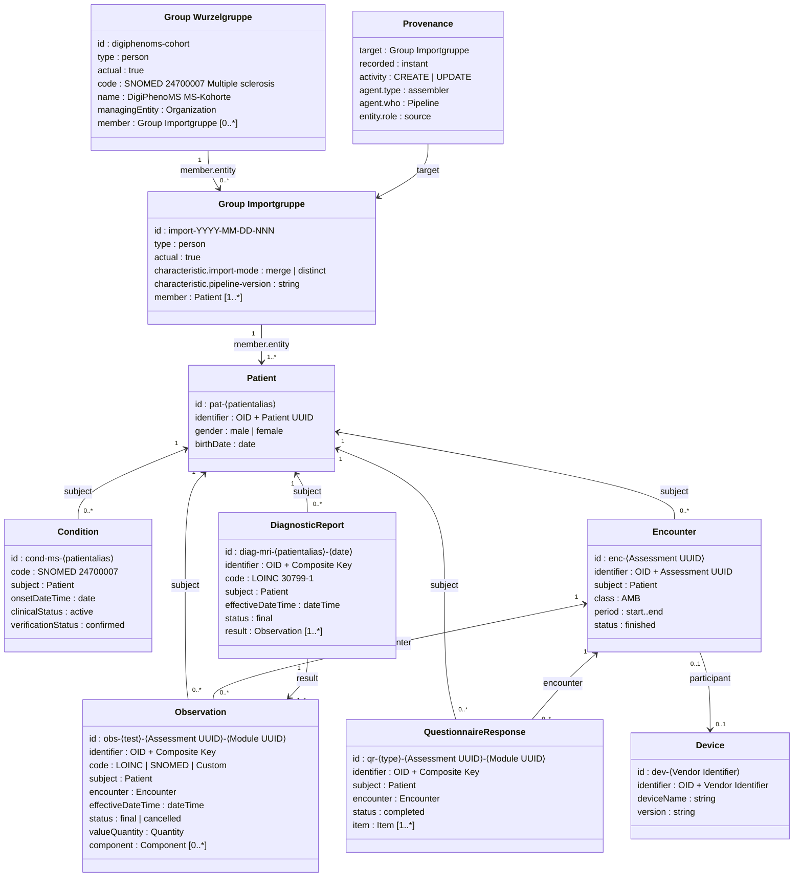
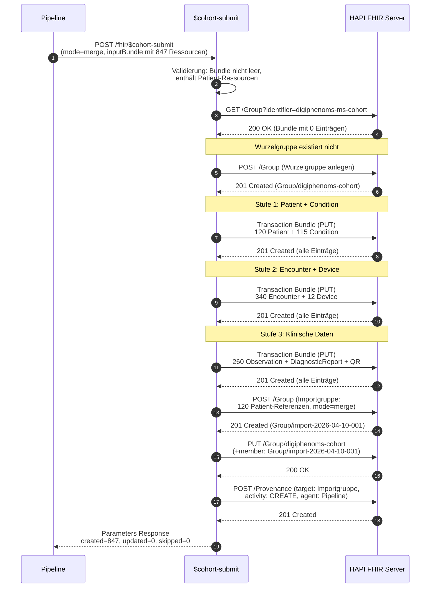
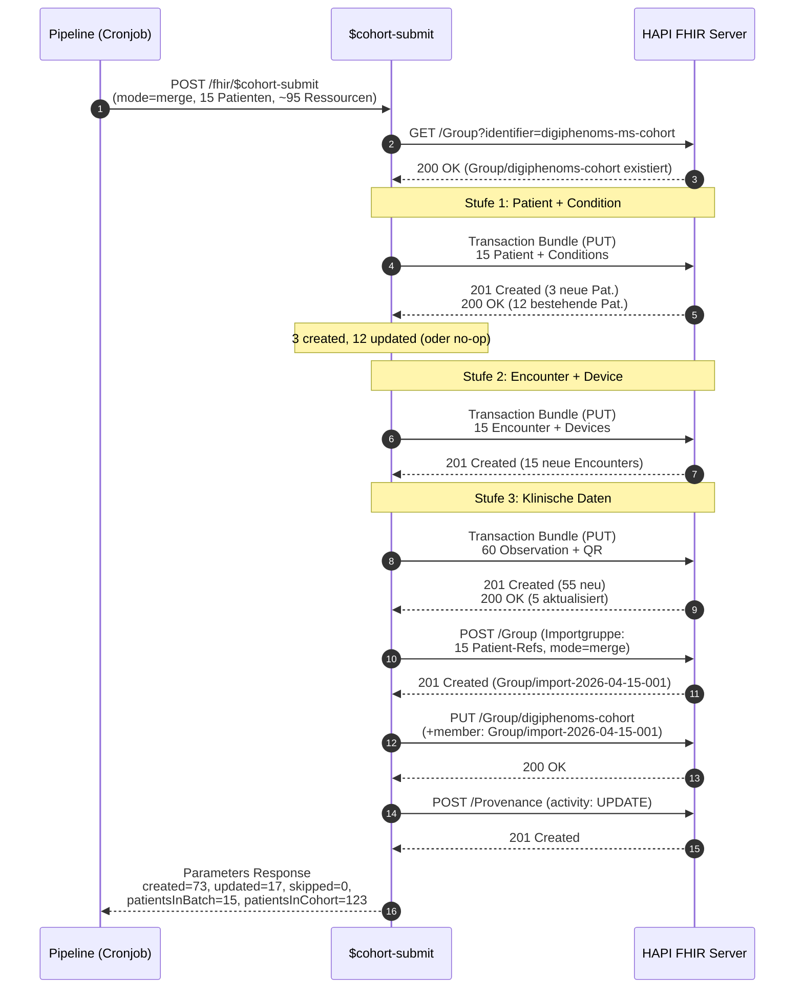
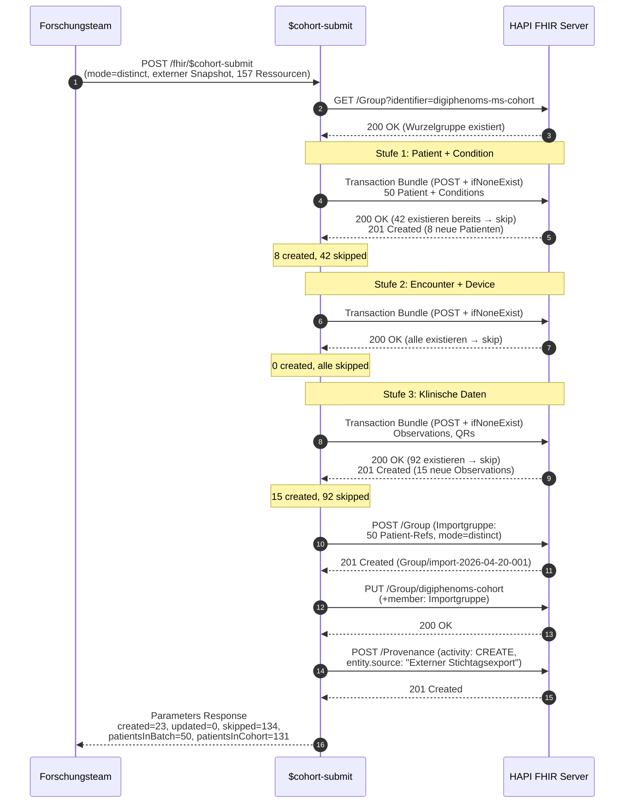
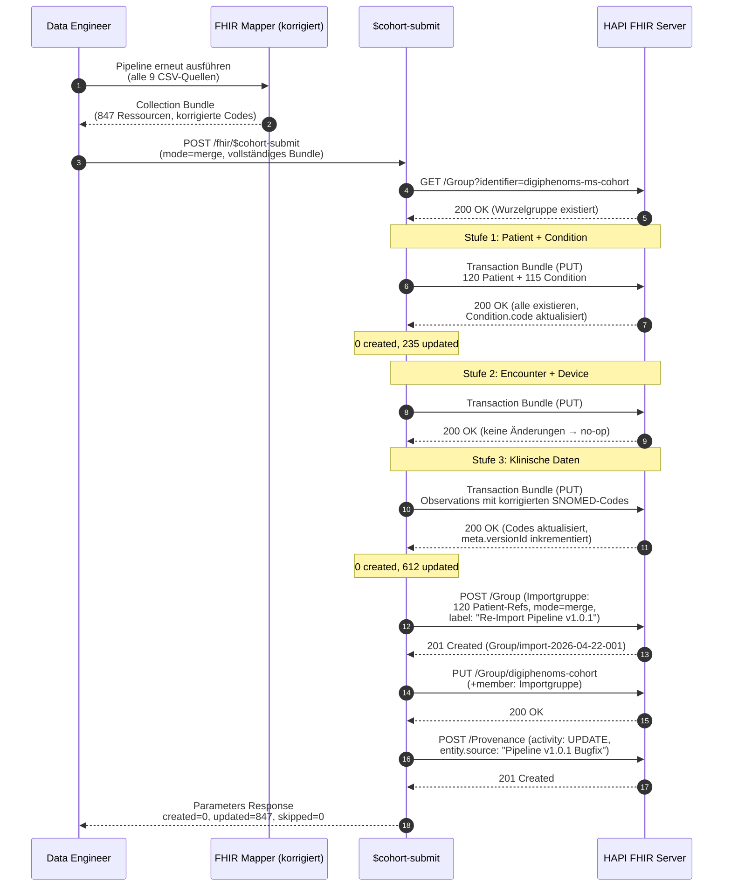

# DigiPhenoMS — $cohort-submit Schnittstellenspezifikation

Spezifikation der benutzerdefinierten FHIR-Operation `$cohort-submit` für den initialen und fortlaufenden Import von Kohortendaten in einen HAPI FHIR R4 Server. Dieses Dokument dient als Grundlage für die Implementierung und Verwendung der Schnittstelle.

**Version:** 1.0.0-draft
**Datum:** 2026-04-10
**Herausgeber:** TU Dresden, DigiPhenoMS

---

## Inhaltsverzeichnis

1. [Überblick](#1-überblick)
2. [FHIR-Ressourcenmodell](#2-fhir-ressourcenmodell)
3. [Group-Hierarchie](#3-group-hierarchie)
4. [Import-Modi](#4-import-modi)
5. [OperationDefinition](#5-operationdefinition)
6. [Anwendungsfälle](#6-anwendungsfälle)
7. [Verarbeitungslogik](#7-verarbeitungslogik)
8. [Provenance](#8-provenance)
9. [Abfrage der Import-Historie](#9-abfrage-der-import-historie)
10. [Ressourcenauflösung und Identifier](#10-ressourcenauflösung-und-identifier)
11. [Fehlerbehandlung](#11-fehlerbehandlung)
12. [Implementierungshinweise](#12-implementierungshinweise)

---

## 1. Überblick

Die DigiPhenoMS-Pipeline transformiert klinische CSV-Daten (9 Datenquellen: Patientenprofil, Assessment-Wrapper, LCLA, 9HPT, SDMT, T25FW, Neuro-QoL, Anamnese, MRT) in FHIR R4 Ressourcen. Die `$cohort-submit`-Operation nimmt das Ergebnis dieser Transformation als Collection Bundle entgegen und importiert es strukturiert in den HAPI FHIR Server.

Die Operation stellt sicher, dass die referenzielle Integrität erhalten bleibt (Patienten vor Encounters vor Observations), organisiert Importvorgänge in einer nachvollziehbaren Group-Hierarchie und unterstützt zwei Modi: Merge (Upsert) und Distinct (nur Anlegen).

---

## 2. FHIR-Ressourcenmodell

Das folgende Klassendiagramm zeigt die FHIR-Ressourcentypen, die im Kontext des Kohortenimports und seiner Speicherung verwendet werden, sowie deren Beziehungen.



Die drei Abhängigkeitsstufen der Operation ergeben sich direkt aus dem Diagramm: Patient und Condition haben keine eingehenden Referenzen und werden zuerst angelegt (Stufe 1). Encounter und Device referenzieren Patient (Stufe 2). Observation, DiagnosticReport und QuestionnaireResponse referenzieren Patient und Encounter (Stufe 3).

---

## 3. Group-Hierarchie

Die Kohortendaten werden durch eine zweistufige Group-Hierarchie organisiert. Alle Gruppen verwenden `Group.type = "person"` und `Group.actual = true` (enumerierte, reale Personen).

### 3.1 Wurzelgruppe (Cohort Root Group)

Die Wurzelgruppe repräsentiert die gesamte DigiPhenoMS-Kohorte. Sie existiert genau einmal pro HAPI-FHIR-Instanz und enthält als Mitglieder ausschließlich Importgruppen (keine direkten Patientenreferenzen). Die Kohorten-ID ist stabil und ändert sich über die gesamte Projektlaufzeit nicht.

```json
{
  "resourceType": "Group",
  "id": "digiphenoms-cohort",
  "identifier": [
    {
      "system": "https://digiphenoms.tu-dresden.de/fhir/cohort",
      "value": "digiphenoms-ms-cohort"
    }
  ],
  "type": "person",
  "actual": true,
  "code": {
    "coding": [
      {
        "system": "http://snomed.info/sct",
        "code": "24700007",
        "display": "Multiple sclerosis"
      }
    ]
  },
  "name": "DigiPhenoMS MS-Kohorte",
  "managingEntity": {
    "reference": "Organization/dresden-carus",
    "display": "Universitätsklinikum Carl Gustav Carus Dresden"
  },
  "member": [
    {
      "entity": { "reference": "Group/import-2026-04-10-001" },
      "period": { "start": "2026-04-10T14:30:00+02:00" }
    }
  ]
}
```

### 3.2 Importgruppe (Import Batch Group)

Jeder Aufruf von `$cohort-submit` erzeugt eine Importgruppe. Sie dokumentiert, welche Patienten in diesem Importvorgang enthalten waren, wann der Import stattfand und in welchem Modus (Distinct/Merge). Die Importgruppe enthält als Mitglieder die konkreten Patient-Referenzen.

```json
{
  "resourceType": "Group",
  "id": "import-2026-04-10-001",
  "identifier": [
    {
      "system": "https://digiphenoms.tu-dresden.de/fhir/import-batch",
      "value": "import-2026-04-10-001"
    }
  ],
  "type": "person",
  "actual": true,
  "name": "Import 2026-04-10 #001",
  "characteristic": [
    {
      "code": {
        "coding": [
          {
            "system": "https://digiphenoms.tu-dresden.de/fhir/CodeSystem/import-metadata",
            "code": "import-mode"
          }
        ]
      },
      "valueCodeableConcept": {
        "coding": [
          {
            "system": "https://digiphenoms.tu-dresden.de/fhir/CodeSystem/import-mode",
            "code": "merge"
          }
        ]
      },
      "exclude": false
    },
    {
      "code": {
        "coding": [
          {
            "system": "https://digiphenoms.tu-dresden.de/fhir/CodeSystem/import-metadata",
            "code": "pipeline-version"
          }
        ]
      },
      "valueCodeableConcept": { "text": "1.0.0" },
      "exclude": false
    }
  ],
  "member": [
    {
      "entity": { "reference": "Patient/pat-abc-1001" },
      "period": { "start": "2026-04-10T14:30:00+02:00" }
    },
    {
      "entity": { "reference": "Patient/pat-def-1002" },
      "period": { "start": "2026-04-10T14:30:00+02:00" }
    }
  ]
}
```

### 3.3 Hierarchie-Übersicht

```
Group/digiphenoms-cohort                       Wurzelgruppe (stabil, 1x)
├── member → Group/import-2026-04-10-001       Initialer Import
│             ├── member → Patient/pat-abc-1001
│             ├── member → Patient/pat-def-1002
│             └── member → Patient/pat-ghi-1003
├── member → Group/import-2026-04-15-001       Folgeimport
│             ├── member → Patient/pat-jkl-1004
│             └── member → Patient/pat-abc-1001   (erneut, neue Observations)
└── member → Group/import-2026-05-01-001       Weiterer Folgeimport
              └── member → Patient/pat-abc-1001
```

---

## 4. Import-Modi

### 4.1 Merge-Modus (Standard)

Merge ist der Standardmodus für fortlaufende Aktualisierungen. Er fügt neue Ressourcen hinzu und aktualisiert bestehende per Conditional PUT.

| Ressource             | Bei Erstimport     | Bei Folgeimport                 |
| --------------------- | ------------------ | ------------------------------- |
| Patient               | Conditional Create | Update (Demografie-Änderungen)  |
| Condition             | Conditional Create | Update (Statusänderungen)       |
| Encounter             | Conditional Create | Kein Update (bereits final)     |
| Device                | Conditional Create | Kein Update (statisch)          |
| Observation           | Conditional Create | Update (Wertkorrektur möglich)  |
| DiagnosticReport      | Conditional Create | Update (Befundergänzung)        |
| QuestionnaireResponse | Conditional Create | Kein Update (bereits completed) |

Bundle-Entry im Merge-Modus:

```json
{
  "request": {
    "method": "PUT",
    "url": "Patient?identifier=urn:oid:2.16.840.1.113883.3.digiphenoms.patient|pat-abc-1001"
  }
}
```

### 4.2 Distinct-Modus

Distinct importiert neue Ressourcen, ohne bestehende zu verändern. Technisch über Conditional POST mit `ifNoneExist`:

```json
{
  "request": {
    "method": "POST",
    "url": "Patient",
    "ifNoneExist": "identifier=urn:oid:2.16.840.1.113883.3.digiphenoms.patient|pat-abc-1001"
  }
}
```

| Situation                          | Merge        | Distinct    |
| ---------------------------------- | ------------ | ----------- |
| Ressource existiert, Wert geändert | Überschreibt | Überspringt |
| Neue Ressource                     | Anlegen      | Anlegen     |

### 4.3 Wahl des Modus

| Szenario                                          | Empfohlener Modus               |
| ------------------------------------------------- | ------------------------------- |
| Erstmalige Beladung des Servers                   | Merge oder Distinct (identisch) |
| Regelmäßiger Datenabzug mit aktualisierten Werten | Merge                           |
| Import eines Forschungsdatensatzes als Snapshot   | Distinct                        |
| Re-Import nach Pipeline-Korrektur                 | Merge                           |
| Paralleler Import verschiedener Datenstände       | Distinct                        |

---

## 5. OperationDefinition

### 5.1 Formale Definition (FHIR R4)

```json
{
  "resourceType": "OperationDefinition",
  "id": "digiphenoms-cohort-submit",
  "url": "https://digiphenoms.tu-dresden.de/fhir/OperationDefinition/cohort-submit",
  "version": "1.0.0",
  "name": "CohortSubmit",
  "title": "DigiPhenoMS Cohort Data Submit",
  "status": "draft",
  "kind": "operation",
  "experimental": true,
  "date": "2026-04-10",
  "publisher": "TU Dresden, DigiPhenoMS",
  "description": "Submits a batch of cohort data to the FHIR server. Manages a Group hierarchy for referential integrity and supports two modes: merge (upsert) and distinct (create-only).",
  "affectsState": true,
  "code": "cohort-submit",
  "system": true,
  "type": false,
  "instance": false,
  "parameter": [
    {
      "name": "inputBundle",
      "use": "in",
      "min": 1,
      "max": "1",
      "documentation": "FHIR Bundle (type=collection) containing the resources to import. Must include at least one Patient resource.",
      "type": "Bundle"
    },
    {
      "name": "mode",
      "use": "in",
      "min": 0,
      "max": "1",
      "documentation": "Import mode. 'merge' (default): conditional PUT. 'distinct': conditional POST with If-None-Exist.",
      "type": "code",
      "binding": {
        "strength": "required",
        "valueSet": "https://digiphenoms.tu-dresden.de/fhir/ValueSet/import-mode"
      }
    },
    {
      "name": "cohortId",
      "use": "in",
      "min": 0,
      "max": "1",
      "documentation": "Identifier of the cohort root group. Defaults to 'digiphenoms-ms-cohort'. Created if absent.",
      "type": "string"
    },
    {
      "name": "batchLabel",
      "use": "in",
      "min": 0,
      "max": "1",
      "documentation": "Human-readable label for this import batch. Auto-generated from timestamp if omitted.",
      "type": "string"
    },
    {
      "name": "outcome",
      "use": "out",
      "min": 1,
      "max": "1",
      "documentation": "OperationOutcome with the import result.",
      "type": "OperationOutcome"
    },
    {
      "name": "importGroup",
      "use": "out",
      "min": 1,
      "max": "1",
      "documentation": "Reference to the newly created import batch Group.",
      "type": "Reference"
    },
    {
      "name": "statistics",
      "use": "out",
      "min": 1,
      "max": "1",
      "documentation": "Import statistics.",
      "type": "string",
      "part": [
        {
          "name": "resourcesCreated",
          "use": "out",
          "min": 1,
          "max": "1",
          "type": "integer",
          "documentation": "Resources newly created."
        },
        {
          "name": "resourcesUpdated",
          "use": "out",
          "min": 1,
          "max": "1",
          "type": "integer",
          "documentation": "Resources updated (merge only; 0 in distinct)."
        },
        {
          "name": "resourcesSkipped",
          "use": "out",
          "min": 1,
          "max": "1",
          "type": "integer",
          "documentation": "Resources skipped (distinct only; 0 in merge)."
        },
        {
          "name": "patientsInBatch",
          "use": "out",
          "min": 1,
          "max": "1",
          "type": "integer",
          "documentation": "Distinct patients in this batch."
        },
        {
          "name": "patientsInCohort",
          "use": "out",
          "min": 1,
          "max": "1",
          "type": "integer",
          "documentation": "Total patients in cohort after import."
        }
      ]
    }
  ]
}
```

### 5.2 ValueSet: Import-Modus

```json
{
  "resourceType": "ValueSet",
  "id": "import-mode",
  "url": "https://digiphenoms.tu-dresden.de/fhir/ValueSet/import-mode",
  "name": "ImportMode",
  "title": "DigiPhenoMS Import Mode",
  "status": "draft",
  "compose": {
    "include": [
      {
        "system": "https://digiphenoms.tu-dresden.de/fhir/CodeSystem/import-mode",
        "concept": [
          { "code": "merge", "display": "Merge (Create or Update)" },
          { "code": "distinct", "display": "Distinct (Create only)" }
        ]
      }
    ]
  }
}
```

### 5.3 Aufruf-Beispiel

```http
POST /fhir/$cohort-submit
Content-Type: application/fhir+json

{
  "resourceType": "Parameters",
  "parameter": [
    { "name": "mode", "valueCode": "merge" },
    { "name": "cohortId", "valueString": "digiphenoms-ms-cohort" },
    { "name": "batchLabel", "valueString": "MSPT-Datenexport April 2026" },
    {
      "name": "inputBundle",
      "resource": {
        "resourceType": "Bundle",
        "type": "collection",
        "entry": [
          {
            "resource": {
              "resourceType": "Patient",
              "id": "pat-abc-1001",
              "identifier": [{ "system": "urn:oid:2.16.840.1.113883.3.digiphenoms.patient", "value": "pat-abc-1001" }],
              "gender": "female",
              "birthDate": "1985-01-01"
            }
          },
          {
            "resource": {
              "resourceType": "Observation",
              "id": "obs-9hpt-assess001-mod001",
              "status": "final",
              "code": { "coding": [{ "system": "http://loinc.org", "code": "83141-2", "display": "9-Hole Pegboard Dexterity Test" }] },
              "subject": { "reference": "Patient/pat-abc-1001" },
              "encounter": { "reference": "Encounter/enc-assess001" },
              "effectiveDateTime": "2026-04-10T10:30:00+02:00",
              "valueQuantity": { "value": -0.85, "unit": "{z-score}", "system": "http://unitsofmeasure.org" }
            }
          }
        ]
      }
    }
  ]
}
```

### 5.4 Antwort-Beispiel

```json
{
  "resourceType": "Parameters",
  "parameter": [
    {
      "name": "outcome",
      "resource": {
        "resourceType": "OperationOutcome",
        "issue": [
          {
            "severity": "information",
            "code": "informational",
            "diagnostics": "Import completed successfully. Mode: merge."
          }
        ]
      }
    },
    {
      "name": "importGroup",
      "valueReference": { "reference": "Group/import-2026-04-10-001" }
    },
    {
      "name": "statistics",
      "part": [
        { "name": "resourcesCreated", "valueInteger": 47 },
        { "name": "resourcesUpdated", "valueInteger": 3 },
        { "name": "resourcesSkipped", "valueInteger": 0 },
        { "name": "patientsInBatch", "valueInteger": 5 },
        { "name": "patientsInCohort", "valueInteger": 127 }
      ]
    }
  ]
}
```

---

## 6. Anwendungsfälle

### UC-1: Initialer Kohorten-Import

**Akteur:** Studienkoordinator / Data Engineer
**Auslöser:** Die DigiPhenoMS-Kohorte wird erstmalig auf dem HAPI FHIR Server bereitgestellt.
**Vorbedingung:** Der HAPI FHIR Server ist leer. Die Mapping-Pipeline hat die CSV-Rohdaten aller 9 Datenquellen in ein FHIR Collection Bundle transformiert.

**Ablauf:**

1. Der Akteur ruft `$cohort-submit` mit dem Collection Bundle auf (mode=merge).
2. Die Wurzelgruppe existiert nicht und wird angelegt.
3. Patient- und Condition-Ressourcen werden per Conditional PUT erstellt.
4. Encounter- und Device-Ressourcen werden erstellt.
5. Observations, DiagnosticReports und QuestionnaireResponses werden erstellt.
6. Importgruppe wird erstellt und mit allen Patienten verknüpft.
7. Wurzelgruppe erhält die Importgruppe als erstes Mitglied.
8. Provenance dokumentiert den Import.

**Nachbedingung:** Alle Kohortendaten auf dem Server. Antwort: z.B. 847 created, 0 updated, 0 skipped.



---

### UC-2: Fortlaufende Aktualisierung (Merge)

**Akteur:** Automatisierte Pipeline (Cronjob) oder Data Engineer
**Auslöser:** 15 Patienten haben seit dem letzten Import neue MSPT-Sitzungen absolviert, 3 davon sind neu.
**Vorbedingung:** Server enthält Daten aus dem Erstimport.

**Ablauf:**

1. `$cohort-submit` mit mode=merge und inkrementellem Bundle.
2. Wurzelgruppe existiert — wird gelesen.
3. 12 bekannte Patienten: Conditional PUT findet bestehende Ressourcen, aktualisiert bei Bedarf.
4. 3 neue Patienten: Conditional PUT findet keine Treffer, legt an.
5. Neue Observations werden angelegt, bestehende mit gleicher ID aktualisiert.
6. Neue Importgruppe mit 15 Patienten-Referenzen.
7. Wurzelgruppe um Importgruppe erweitert.

**Nachbedingung:** 3 neue Patienten, aktualisierte Werte. Import-Historie zeigt 2 Importe.



---

### UC-3: Snapshot-Import (Distinct)

**Akteur:** Forschungsteam
**Auslöser:** Externer Kooperationspartner liefert Stichtagsexport. Bestehende Daten dürfen nicht verändert werden.
**Vorbedingung:** Server enthält eigene Daten. Externer Datensatz enthält teils dieselben Patienten mit abweichenden Werten.

**Ablauf:**

1. `$cohort-submit` mit mode=distinct.
2. Bekannte Patienten/Observations: POST mit ifNoneExist erkennt Existenz, überspringt.
3. Neue Patienten und Observations: werden angelegt.
4. Importgruppe dokumentiert alle Patienten des Snapshots (auch übersprungene).
5. Wurzelgruppe um Importgruppe erweitert.

**Nachbedingung:** Bestehende Daten unverändert. Nur neue Ressourcen hinzugefügt. Antwort: z.B. 23 created, 0 updated, 134 skipped.



---

### UC-4: Re-Import nach Pipeline-Korrektur (Merge)

**Akteur:** Data Engineer
**Auslöser:** Bug im FHIR-Mapper behoben (z.B. korrigierter SNOMED-Code). Gesamte Kohorte muss mit korrigierten Werten erneut importiert werden.
**Vorbedingung:** Server enthält Daten mit fehlerhaften Werten.

**Ablauf:**

1. Korrigierte Pipeline über alle CSV-Daten ausführen.
2. `$cohort-submit` mit mode=merge und vollständigem Bundle.
3. Alle Ressourcen per Conditional PUT aktualisiert — korrigierte Werte überschreiben fehlerhafte.
4. Neue Importgruppe dokumentiert den Re-Import.

**Nachbedingung:** Alle Ressourcen tragen korrigierte Werte. FHIR-Versionierung (`meta.versionId`) dokumentiert Änderung.



---

## 7. Verarbeitungslogik

### 7.1 Ablaufschritte

```
1. Eingabevalidierung
   ├── Bundle vorhanden und nicht leer?
   ├── Mindestens ein Patient enthalten?
   └── Mode gültig (merge | distinct)?

2. Wurzelgruppe sicherstellen
   ├── GET Group?identifier=<cohortId>
   ├── Falls nicht vorhanden: POST Group (Wurzelgruppe anlegen)
   └── ID der Wurzelgruppe merken

3. Ressourcen nach Typ sortieren (Abhängigkeitsreihenfolge)
   ├── Stufe 1: Patient, Condition
   ├── Stufe 2: Encounter, Device
   └── Stufe 3: Observation, DiagnosticReport, QuestionnaireResponse

4. Pro Stufe: Transaction Bundle erzeugen und senden
   ├── merge  → PUT mit Conditional URL (identifier-basiert)
   └── distinct → POST mit ifNoneExist (identifier-basiert)

5. Ergebnis je Entry auswerten
   ├── 201 Created → created++
   ├── 200 OK (merge, geändert) → updated++
   └── 200 OK (distinct, unverändert) → skipped++

6. Importgruppe erzeugen
   ├── Group mit Patienten-Referenzen anlegen
   ├── Characteristic: mode, pipeline-version, Zeitstempel
   └── POST Group

7. Wurzelgruppe aktualisieren
   └── Importgruppe als neues member hinzufügen

8. Provenance anlegen
   ├── target → Importgruppe
   ├── agent → Pipeline (Device oder Organization)
   ├── activity → CREATE (initial) oder UPDATE (Folgeimport)
   └── recorded → Zeitstempel

9. Antwort zusammenstellen
   ├── OperationOutcome mit Ergebnis
   ├── Referenz auf Importgruppe
   └── Statistiken
```

### 7.2 Referenzielle Integrität

Die Reihenfolge der Transaction Bundles (Patient → Encounter → Observation) stellt sicher, dass referenzierte Ressourcen bereits existieren. Innerhalb eines Transaction Bundles werden Referenzen über `fullUrl` aufgelöst. Referenzen auf Ressourcen aus früheren Stufen verwenden die stabile ID (z.B. `Patient/pat-abc-1001`).

### 7.3 Idempotenz

Beide Modi sind auf Ressourcenebene idempotent: Wiederholtes Senden desselben Bundles führt zum gleichen Serverzustand. Die Importgruppe ist bewusst nicht idempotent — jeder Aufruf erzeugt eine neue, um die vollständige Import-Historie abzubilden.

---

## 8. Provenance

Jeder Import erzeugt eine Provenance-Ressource:

```json
{
  "resourceType": "Provenance",
  "target": [{ "reference": "Group/import-2026-04-10-001" }],
  "recorded": "2026-04-10T14:30:00+02:00",
  "activity": {
    "coding": [
      {
        "system": "http://terminology.hl7.org/CodeSystem/v3-DataOperation",
        "code": "CREATE",
        "display": "create"
      }
    ]
  },
  "agent": [
    {
      "type": {
        "coding": [
          {
            "system": "http://terminology.hl7.org/CodeSystem/provenance-participant-type",
            "code": "assembler",
            "display": "Assembler"
          }
        ]
      },
      "who": { "display": "DigiPhenoMS FHIR Mapper v1.0.0" }
    }
  ],
  "entity": [
    {
      "role": "source",
      "what": { "display": "CSV-Export DigiPhenoMS MSPT-System, April 2026" }
    }
  ]
}
```

---

## 9. Abfrage der Import-Historie

```http
# Alle Importe der Kohorte
GET /Group?member=Group/digiphenoms-cohort&_sort=-_lastUpdated

# Patienten eines bestimmten Imports
GET /Group/import-2026-04-10-001

# Alle Patienten der gesamten Kohorte
GET /Patient?_has:Group:member:_id=digiphenoms-cohort

# Alle Daten der Kohorte
GET /Group/digiphenoms-cohort/$everything

# Provenance eines Imports
GET /Provenance?target=Group/import-2026-04-10-001
```

---

## 10. Ressourcenauflösung und Identifier

Die Conditional-URLs verwenden die Identifier-Systeme aus `pipeline.yaml`:

| Ressource             | Identifier-System (OID)                              | Conditional-Schlüssel         |
| --------------------- | ---------------------------------------------------- | ----------------------------- |
| Patient               | `urn:oid:2.16.840.1.113883.3.digiphenoms.patient`    | Patient UUID                  |
| Encounter             | `urn:oid:2.16.840.1.113883.3.digiphenoms.assessment` | Assessment UUID               |
| Device                | `urn:oid:2.16.840.1.113883.3.digiphenoms.module`     | Vendor Identifier             |
| Observation           | `urn:oid:2.16.840.1.113883.3.digiphenoms.module`     | Assessment UUID + Module UUID |
| Condition             | `urn:oid:2.16.840.1.113883.3.digiphenoms.patient`    | Patient UUID + Condition Type |
| DiagnosticReport      | `urn:oid:2.16.840.1.113883.3.digiphenoms.patient`    | Patient UUID + Datum          |
| QuestionnaireResponse | `urn:oid:2.16.840.1.113883.3.digiphenoms.module`     | Assessment UUID + Module UUID |

**Voraussetzung:** Die Mapper-Pipeline muss für jede Ressource ein `identifier`-Element mit dem projektspezifischen System erzeugen. Aktuell werden IDs nur im `id`-Feld gesetzt — die `identifier`-Liste muss ergänzt werden.

---

## 11. Fehlerbehandlung

### 11.1 HTTP-Statuscodes

| Code                      | Bedeutung          | Beschreibung                                                            |
| ------------------------- | ------------------ | ----------------------------------------------------------------------- |
| 200 OK                    | Erfolg             | Alle Ressourcen verarbeitet. Response enthält Parameters mit Ergebnis.  |
| 400 Bad Request           | Ungültige Eingabe  | Bundle fehlt, ist leer, enthält keinen Patient oder ungültiger Mode.    |
| 401 Unauthorized          | Authentifizierung  | Fehlende oder ungültige Credentials.                                    |
| 403 Forbidden             | Berechtigung       | Unzureichende Berechtigungen für die Operation.                         |
| 422 Unprocessable Entity  | Validierungsfehler | Bundle enthält invalide FHIR-Ressourcen oder Identifier-Systeme fehlen. |
| 500 Internal Server Error | Serverfehler       | Unerwarteter Fehler bei der Verarbeitung.                               |
| 504 Gateway Timeout       | Timeout            | Verarbeitung hat das Server-Timeout überschritten.                      |

### 11.2 OperationOutcome

Bei Fehlern (HTTP ≥ 400) liefert der Server ein OperationOutcome mit maschinenlesbarem Fehlercode in `details.text`:

```json
{
  "resourceType": "OperationOutcome",
  "issue": [
    {
      "severity": "error",
      "code": "invalid",
      "diagnostics": "Input bundle must contain at least one Patient resource.",
      "details": {
        "text": "DIGIPHENOMS-002"
      }
    }
  ]
}
```

### 11.3 Fehlercodes

| Code            | Bedeutung                                           | HTTP |
| --------------- | --------------------------------------------------- | ---- |
| DIGIPHENOMS-001 | Bundle fehlt oder ist leer                          | 400  |
| DIGIPHENOMS-002 | Kein Patient im Bundle enthalten                    | 400  |
| DIGIPHENOMS-003 | Ungültiger Import-Modus (weder merge noch distinct) | 400  |
| DIGIPHENOMS-004 | Transaction Bundle fehlgeschlagen (Stufe N)         | 422  |
| DIGIPHENOMS-005 | Wurzelgruppe konnte nicht angelegt/gefunden werden  | 500  |
| DIGIPHENOMS-006 | Importgruppe konnte nicht angelegt werden           | 500  |

### 11.4 Client-seitige Fehlerbehandlung

Der Python-Client (`CohortSubmitClient`) wirft `CohortSubmitError` mit den Attributen `status_code` (HTTP-Code) und `operation_outcome` (geparster OperationOutcome-Body, falls vorhanden). Netzwerk- und Timeout-Fehler werden ebenfalls als `CohortSubmitError` propagiert.

---

## 12. Implementierungshinweise

### 12.1 HAPI FHIR Server (Java)

Die Operation wird als Spring `@Component` mit `@Operation`-Annotation implementiert und über `hapi.fhir.custom-bean-packages` in der `application.yaml` registriert:

```yaml
hapi:
  fhir:
    custom-bean-packages: de.tu_dresden.digiphenoms.fhir.operations
```

```java
@Component
public class CohortSubmitOperation {

    @Operation(name = "$cohort-submit", idempotent = false)
    public Parameters cohortSubmit(
            @OperationParam(name = "inputBundle") Bundle inputBundle,
            @OperationParam(name = "mode") CodeType mode,
            @OperationParam(name = "cohortId") StringType cohortId,
            @OperationParam(name = "batchLabel") StringType batchLabel) {
        // Implementierung gemäß Abschnitt 7
    }
}
```

### 12.2 Pipeline-Konfiguration (pipeline.yaml)

Der Kohortenimport wird als abschließender Pipeline-Schritt über die Sektion `cohort_submit` in `pipeline.yaml` konfiguriert:

```yaml
cohort_submit:
  enabled: false # true zum Aktivieren
  endpoint: "http://localhost:8080/fhir" # HAPI FHIR Base-URL
  mode: "merge" # merge | distinct
  cohort_id: "digiphenoms-ms-cohort" # Wurzelgruppe Identifier
  timeout: 300 # Sekunden
  batch_label_prefix: "DigiPhenoMS Pipeline" # Prefix für Batch-Label
  verify_ssl: true
```

Die Übermittlung findet nur statt, wenn `enabled: true` gesetzt ist und die Transformation mindestens eine Ressource erzeugt hat.

### 12.3 Identifier-Erzeugung

Jede Ressource erhält ein `identifier`-Element mit dem projektspezifischen OID-System (aus `namespaces` in `pipeline.yaml`). Die Zuordnung Ressourcentyp → Identifier-System ist fest definiert:

| Ressource             | Namespace-Schlüssel | OID                                                  |
| --------------------- | ------------------- | ---------------------------------------------------- |
| Patient               | `patient_system`    | `urn:oid:2.16.840.1.113883.3.digiphenoms.patient`    |
| Condition             | `patient_system`    | `urn:oid:2.16.840.1.113883.3.digiphenoms.patient`    |
| Encounter             | `assessment_system` | `urn:oid:2.16.840.1.113883.3.digiphenoms.assessment` |
| Device                | `module_system`     | `urn:oid:2.16.840.1.113883.3.digiphenoms.module`     |
| Observation           | `module_system`     | `urn:oid:2.16.840.1.113883.3.digiphenoms.module`     |
| DiagnosticReport      | `patient_system`    | `urn:oid:2.16.840.1.113883.3.digiphenoms.patient`    |
| QuestionnaireResponse | `module_system`     | `urn:oid:2.16.840.1.113883.3.digiphenoms.module`     |

### 12.4 Client-Aufruf (Python)

Die Klasse `CohortSubmitClient` kapselt den HTTP-Aufruf und die Fehlerbehandlung. Die Pipeline ruft den Client automatisch auf, wenn `cohort_submit.enabled` gesetzt ist.

```python
from digiphenoms_fhir import CohortSubmitClient, CohortSubmitError

client = CohortSubmitClient(
    base_url="http://localhost:8080/fhir",
    timeout=300,
)

try:
    result = client.submit(
        resources=mapped_resources,
        mode="merge",
        cohort_id="digiphenoms-ms-cohort",
        batch_label="MSPT-Datenexport April 2026",
    )
except CohortSubmitError as e:
    print(f"Import fehlgeschlagen: {e} (HTTP {e.status_code})")
    if e.operation_outcome:
        for issue in e.operation_outcome.get("issue", []):
            print(f"  {issue.get('severity')}: {issue.get('diagnostics')}")
```

### 12.5 CLI-Verwendung

```bash
# Pipeline mit automatischer Übermittlung
digiphenoms-fhir --config config/ --data data/ --output output/ --submit

# Übermittlung deaktivieren (auch wenn in config aktiviert)
digiphenoms-fhir --config config/ --data data/ --output output/ --no-submit

# Endpunkt und Modus per CLI überschreiben
digiphenoms-fhir --config config/ --data data/ --output output/ \
    --fhir-endpoint http://fhir.example.org/fhir \
    --import-mode distinct
```
